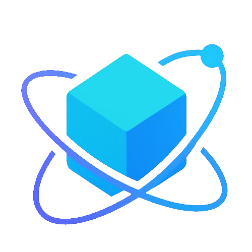

# AegisMind Network



**Next-Generation Privacy AI Network Based on FHE Technology**

AegisMind Network is a revolutionary privacy-preserving AI platform built on Fully Homomorphic Encryption (FHE) technology, enabling secure computation where "data never appears in plaintext."

## 🌟 Features

### Core Technologies
- **Fully Homomorphic Encryption (FHE)** - The holy grail of cryptography
- **HTTPZ Zero-Trust Protocol** - Next-generation internet communication
- **Agent Collaboration Network** - Privacy-preserving AI agent coordination
- **Quantum-Resistant Security** - Future-proof cryptographic protection

### Product Ecosystem
- **AegisChain Mainnet** - FHE-based privacy blockchain
- **AegisSphere Platform** - Decentralized AI agent collaboration network
- **FHE Bridge** - Privacy-preserving cross-chain asset transfer
- **Developer Tools** - Comprehensive SDK and APIs

### Use Cases
- **Healthcare** - Privacy-preserving medical data analysis
- **Financial Services** - Cross-institutional risk management
- **Web3 Social** - Decentralized privacy social networks
- **IoT & Smart Cities** - Secure sensor data processing

## 🚀 Quick Start

### Prerequisites
- Node.js 18+ 
- npm or pnpm
- Git

### Installation

```bash
# Clone the repository
git clone https://github.com/afsdfdf/shader.git
cd shader

# Install dependencies
npm install

# Start development server
npm run dev
```

Open [http://localhost:3000](http://localhost:3000) to view the application.

### Build for Production

```bash
# Create production build
npm run build

# Start production server
npm start
```

## 🏗️ Project Structure

```
shader-showcase/
├── app/                    # Next.js 15 App Router
│   ├── page.tsx           # Homepage
│   ├── products/          # Products page
│   ├── technology/        # Technology overview
│   ├── use-cases/         # Use cases showcase
│   ├── launch/            # Application launcher
│   ├── team/              # Team information
│   ├── roadmap/           # Project roadmap
│   ├── tokenomics/        # Token economics
│   ├── whitepaper/        # Technical whitepaper
│   └── faq/               # Frequently asked questions
├── components/            # Reusable React components
│   ├── ui/                # UI component library
│   ├── shader-background.tsx  # WebGL shader effects
│   ├── header.tsx         # Navigation header
│   └── footer.tsx         # Site footer
├── public/                # Static assets
│   ├── *.png              # Product images and diagrams
│   ├── logo.png           # Brand logo
│   └── robots.txt         # SEO configuration
├── styles/                # CSS styles
└── vercel.json           # Deployment configuration
```

## 🛠️ Tech Stack

- **Framework**: Next.js 15 with App Router
- **Language**: TypeScript
- **Styling**: Tailwind CSS
- **UI Components**: Radix UI + shadcn/ui
- **Animations**: Framer Motion
- **Graphics**: WebGL Shaders (@paper-design/shaders-react)
- **Deployment**: Vercel
- **Package Manager**: npm/pnpm

## 🌐 Deployment

### Vercel (Recommended)

[](https://vercel.com/new/clone?repository-url=https://github.com/afsdfdf/shader)

1. Connect your GitHub repository to Vercel
2. Configure environment variables (if any)
3. Deploy automatically on every push to main

### Manual Deployment

```bash
# Build the project
npm run build

# Deploy the .next folder to your hosting provider
```

## 📱 Features & Optimizations

### Performance
- **Static Site Generation** for optimal loading speeds
- **Image Optimization** with Next.js Image component
- **Code Splitting** and lazy loading
- **WebGL Shaders** for stunning visual effects

### SEO & Accessibility
- **Comprehensive meta tags** and Open Graph
- **Structured data** and sitemap
- **WCAG 2.1 AA compliance**
- **Keyboard navigation** support

### Mobile Experience
- **Responsive design** across all devices
- **Touch-friendly** interactive elements
- **Progressive Web App** capabilities
- **Optimized performance** on mobile networks

## 🔧 Development

### Available Scripts

```bash
npm run dev          # Start development server
npm run build        # Create production build
npm run start        # Start production server
npm run lint         # Run ESLint
```

### Environment Variables

Create a `.env.local` file for local development:

```env
# Add any required environment variables here
```

## 🤝 Contributing

We welcome contributions to AegisMind Network! Please read our contributing guidelines before submitting pull requests.

1. Fork the repository
2. Create a feature branch
3. Make your changes
4. Add tests if applicable
5. Submit a pull request

## 📄 License

This project is licensed under the MIT License - see the [LICENSE](LICENSE) file for details.

## 🔗 Links

- **Website**: [https://aegismind.network](https://aegismind.network)
- **Documentation**: [Coming Soon]
- **Discord**: [Coming Soon]
- **Twitter**: [Coming Soon]
- **GitHub**: [https://github.com/afsdfdf/shader](https://github.com/afsdfdf/shader)

## 📞 Support

For support and questions:
- Create an issue on GitHub
- Join our Discord community
- Follow us on Twitter for updates

---

**Built with ❤️ by the AegisMind Network Team**

*Pioneering the future of privacy-preserving AI and secure computation.*
